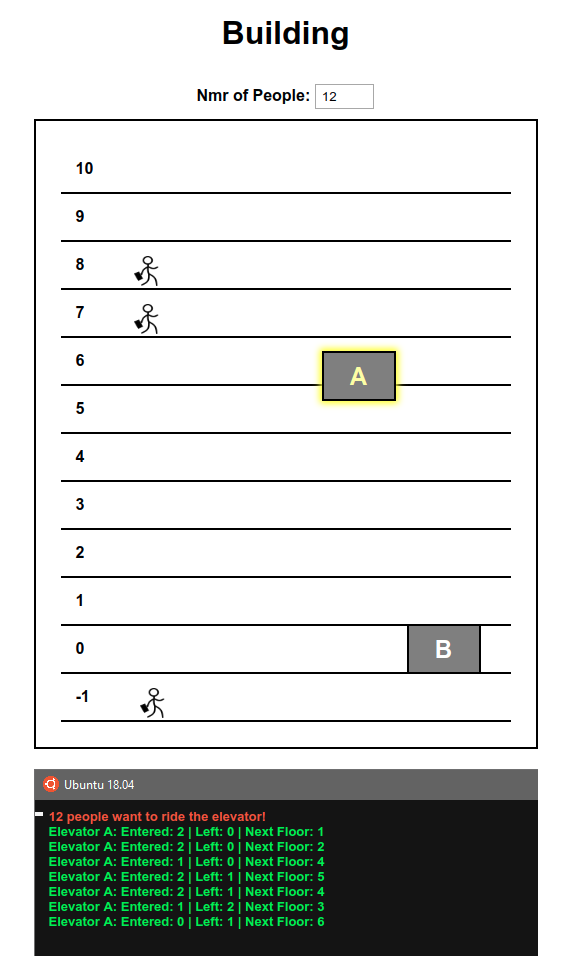

# Keeping Up With the JavaScripts - Project-3
Created using React

### Setup
To run the code do the following, after installing Node.js:
- Run the following command in the directory you want:

```
npx create-react-app my-app
```
- Replace files from **my-app/src/** with the files inside the **src** folder in this repository
- Run the following command to host the React app on localhost:
```
npm start
```

*Instructions on how to run the code were taken from [React tutorial](https://reactjs.org/tutorial/tutorial.html)*

### User Interface


### Description
The **UI** is divided in two parts:
- The area of the **building** where the elevators traverse the floors. The number of people that will be taking the elevators can be set in the input area right above the building, and in front of the label **Nmr of People**. If none or zero is chosen, then the number of people taking the elevators is generated randomly. The elevator itself displays the number of people leaving it in each floor, through a label above its structure. 
- The **console**, right beneath the building area, where the movement of the elevators is tracked, along with the number of people that entered and left the elevator in each floor.

There are two elevators available withing the building, A and B. They both start at ground level when the page is loaded.

### Process
After deciding the number of people that will be taking the elevators, in order for the elevators to start, the user must click one of them. After clicking one elevator, people will be randomly generated, displayed in each floor and the elevator starts to move right away, towards the floor it found to be the best choice given the current circumstances.
The progress made by the elevator can be tracked in the console.
When everyone is successfully delivered, the elevator stands idle in the last floor it visited. If any elevator is clicked at this point, new people are created and displayed, and the elevator sets now a new route and begins to wander through the floors.

### Issues to be fixed
- Elevators don't have a limit in its capacity;
- If an elevator is clicked while the other is still traversing the floors, it will start going after new people, but they are not displayed until the first elevator finishes;
- Console only shows the number of people that will take the elevator, the first time an elevator is clicked. If another elevator is clicked at any given moment, without first refreshing the page, the new elevator will still be trackable in the console, but the number of people that it will take it is not displayed;
- Animation of people entering the elevator doesn't work correctly for elevator B.
